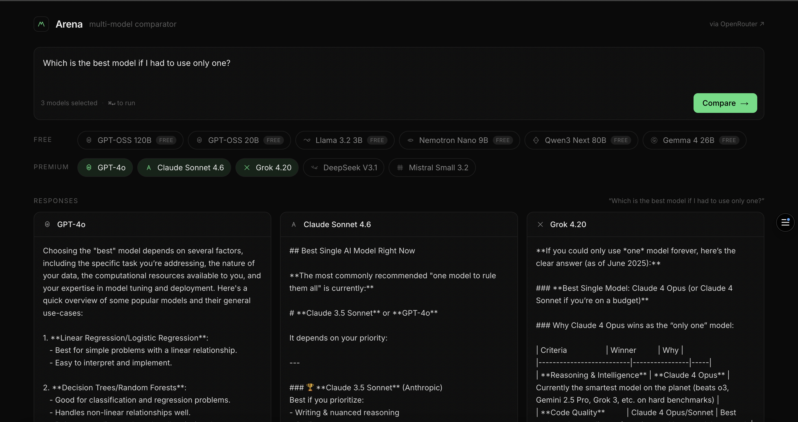
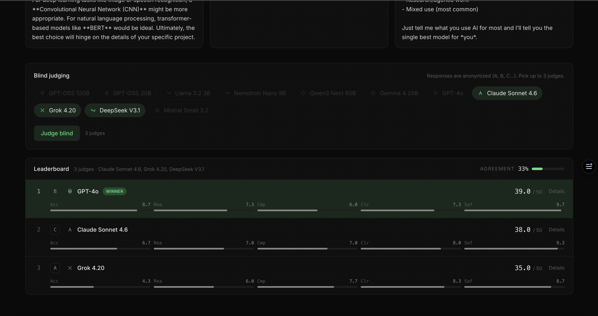

# Arena

**A multi-model LLM comparison tool with blind, rubric-based judging.**

Arena lets you send one prompt to several large language models at once and compare their
answers side by side, streaming in real time. Once the responses are in, a panel of judge
models scores them blind — the answers are anonymized first — and Arena aggregates those
scores into a ranking with an inter-judge agreement metric. It's a fast, honest way to see
how different models actually stack up on a given task.

**Live demo:** [arena-multi-model-judge.vercel.app](https://arena-multi-model-judge.vercel.app)

## Screenshots


*Send one prompt to multiple models and watch them answer in parallel, token by token.*


*Blind judges score each anonymized answer; results are ranked with per-criterion breakdowns and an agreement metric.*

## Features

- **Real-time parallel streaming** — every selected model answers simultaneously, each in its own column, token by token.
- **One key, every provider** — a single OpenRouter API key powers both free (`:free`) and premium models across providers.
- **Blind judging** — responses are anonymized (A, B, C…) before scoring, so judges can't favor a particular model by name (avoids self-preference bias).
- **Standard 5-criterion rubric** — each answer is scored 0–10 on Accuracy, Reasoning, Completeness, Clarity, and Safety (0–50 total).
- **Multi-judge agreement** — with two or more judges, Arena reports how often they agree on the winner.
- **Automatic retry with backoff** — transient rate limits (HTTP 429) and provider errors are retried with exponential backoff before surfacing a failure.
- **Server-side API key** — all OpenRouter calls go through a Next.js API route; the key never reaches the browser.

## Tech stack

- **Next.js** (App Router)
- **TypeScript**
- **Tailwind CSS**
- **OpenRouter API** for unified model access
- Deployed on **Vercel**

## How it works

The client fires parallel requests to a Next.js API route that proxies OpenRouter with
streaming enabled, relaying tokens back over Server-Sent Events — so the `OPENROUTER_API_KEY`
lives only on the server and is never exposed to the client. After the comparison finishes,
the judge route anonymizes the responses and asks each judge model to return structured JSON
scores for the five rubric criteria. Those scores are aggregated into an average-based ranking,
a highlighted winner, and an agreement metric across judges. Rate-limited or failing calls are
retried automatically with backoff before any error is shown.

## Run locally

```bash
# 1. Clone
git clone https://github.com/richardjrv96-cmd/arena-multi-model-judge.git
cd arena-multi-model-judge

# 2. Install dependencies
npm install

# 3. Configure your key
cp .env.example .env.local
# then edit .env.local and set OPENROUTER_API_KEY=sk-or-...
# (get a key at https://openrouter.ai/keys)

# 4. Run
npm run dev
```

Open [http://localhost:3000](http://localhost:3000), write a prompt, pick a few models, and
hit **Compare**. When the responses finish, choose your judges and run **Judge blind**.

## Notes

Free-tier models are convenient for trying Arena out, but they share limited capacity on
OpenRouter and can be rate-limited or temporarily unavailable. Arena retries automatically,
but for consistent results, premium models accessed through your own OpenRouter key are
considerably more reliable.
